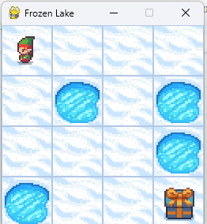

This code trains an agent on FrozenLake using Q-learning by letting it explore actions,
receive rewards, and update a Q-table that stores how good each action is in each state. 
Over many episodes, exploration decreases and the agent learns the best path to the goal.
After training, the agent uses the learned Q-table to act greedily and reach the goal without guessing.

Image of model in testing phase

# Q-learning update
Q[state, action] = Q[state, action] + learning_rate * (reward + discount_factor * np.max(Q[next_state]) - Q[state, action])
🐕 This Line = Dog Updating Its Memory
Think of Q[state, action] as:
“How good does the dog THINK this action is in this situation?”

🧠 Break It Into Human (Dog) Thoughts
Step 1️⃣ Old belief
Q[state, action]
Dog thinks:
“Last time I believed this move was worth X treats.”

Step 2️⃣ What actually happened
reward
Dog asks:
“Did I get a treat right now?”
Fell in hole → 0
Reached goal → 1

Step 3️⃣ Look into the future
discount_factor * np.max(Q[next_state])
Dog thinks:
“From where I landed, how many treats can I get later?”
np.max(Q[next_state])
→ best possible future action
discount_factor (γ)
→ how much the dog cares about future treats
📌 This is long-term thinking

Step 4️⃣ Calculate mistake (surprise!)
reward + future_reward - old_belief
Dog realizes:
“I expected X treats…
but actually I got Y treats.”
This difference is the learning signal.

Step 5️⃣ Update belief slowly
learning_rate * (difference)
Dog does not change opinion suddenly.
Instead:
“Let me adjust my belief a little.”
That’s what learning_rate does.
🧩 Put It All Together (Dog Sentence)
“My new belief =
my old belief
how fast I learn × (what actually happened − what I expected)”

🐕 Very Simple Example
Imagine:
Dog thought going RIGHT = 0.5 treats
Dog went RIGHT
Fell into hole → reward = 0
Future reward = 0
So dog thinks:
“Hmm… I was wrong.”
Q-value goes down.

Another case:
Dog thought RIGHT = 0.2 treats
Reached goal → reward = 1
Dog thinks:
“Oh! This is much better than I thought.”
Q-value goes up.